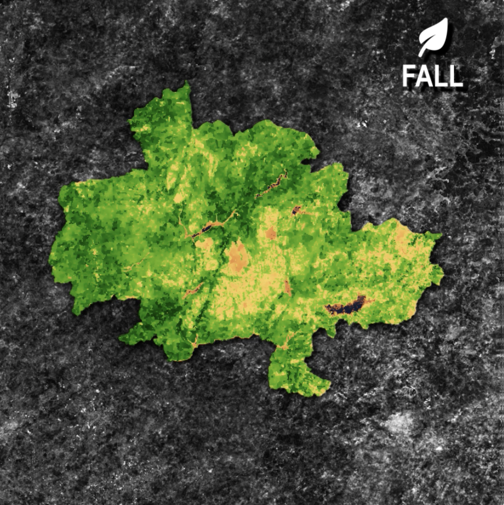

# EO Quick Videos

Quick videos illustrating Earth observation insights using real satellite data.

Images and data created using
[Google Earth Engine](https://earthengine.google.com/).

## Urban Land Cover

Guimarães Municipality, in Portugal, urban land cover between 1986 and 2021,
available [here](./media/guimaraes-land-cover.mp4).

  

## Vegetation Index

[NVDI](https://en.wikipedia.org/wiki/Normalized_difference_vegetation_index)
for Peneda-Gerês National Park, in Portugal, across different seasons during 2020,
available [here](./media/geres-vegetation-index.mp4).

  

### Acknowledgements

Special thank you to expert Sara Aparício for suggestions and discussion.

Thank you to GEE team for an amazing product.

Seasons icons by Adrien Coquet from the Noun Project.

Satellite icon by Font Awesome.

Vivaldi's Four Seasons by John Harrison with the Wichita State University
Chamber Players.
